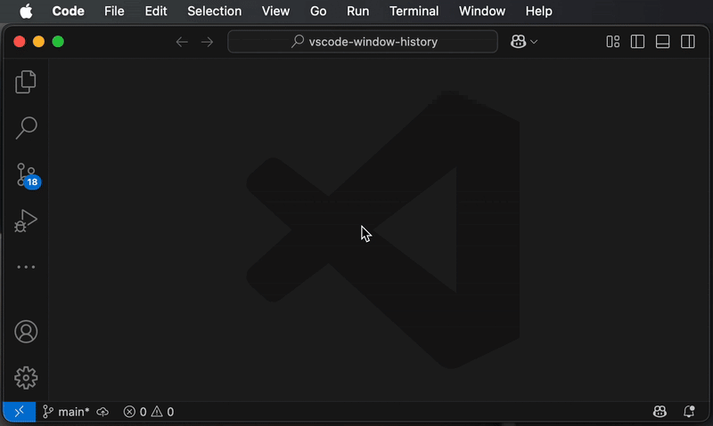
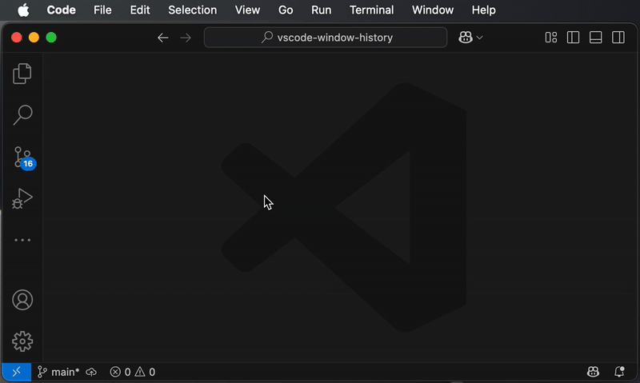

# VSCode Window History

A keyboard-first window switcher for VSCode that lets you quickly jump between your open workspace windows.

## ✨ Features

- **Cycle through open windows** using a keyboard shortcut.
- **Press digits (1–9)** to instantly jump to a specific window.
- **Use arrow keys** to navigate the pick list.
- **Press Enter** to switch to the selected window.

## 🚀 Usage

1. Press your configured shortcut (e.g. `Command+^`).

   → A quick pick dialog appears showing your most recently used VSCode windows.

2. Navigate:

   → Press **1–9** to jump directly to a window.

   → Use **Arrow Keys** or **press the shortcut again** to move selection down.

   → Press **Enter** to jump to the selected window.

   → Press **Esc** to cancel.

> 💡 Windows are sorted by last activity time (most recent on top).

## ⚙️ Shortcut Configuration

To use the extension effectively, you’ll want to assign a custom keyboard shortcut to trigger the switcher:

1. Open the Command Palette with `Command+Shift+P` or `Ctrl+Shift+P`
2. Choose "Preferences: Open Keyboard Shortcuts"
3. Search for: `vscode-window-history.goToPreviousWindow`
4. Click the "+" icon to assign your preferred keybinding (e.g. `Command+^`)

## 🧠 How It Works

Each workspace window writes its identity (PID and path) to a shared file:

`~/.vscode-window-history/history.json`

When the command is triggered:

1. The history file is read.
2. Your current window is excluded.
3. A dialog is shown to choose another window.
4. The chosen window is moved to the beginning of the list.
5. The rearranged list is saved back into the history file.

## 🕰️ Background Information

The extension was developed especially for macOS users, because the operating system does not offer an easy way to quickly jump back and forth between recent windows. However, the extension also works under Linux and Windows and may also be a useful tool there.

## 🛟 Help

If you have any questions or found a bug, first take a look at the open and closed [issues][issues]. If you cannot find an answer, don't hesitate to get in touch and open a new issue. We are happy to help.

## 📄 License

MIT License

[issues]: https://github.com/softwaretheke/vscode-window-history/issues
